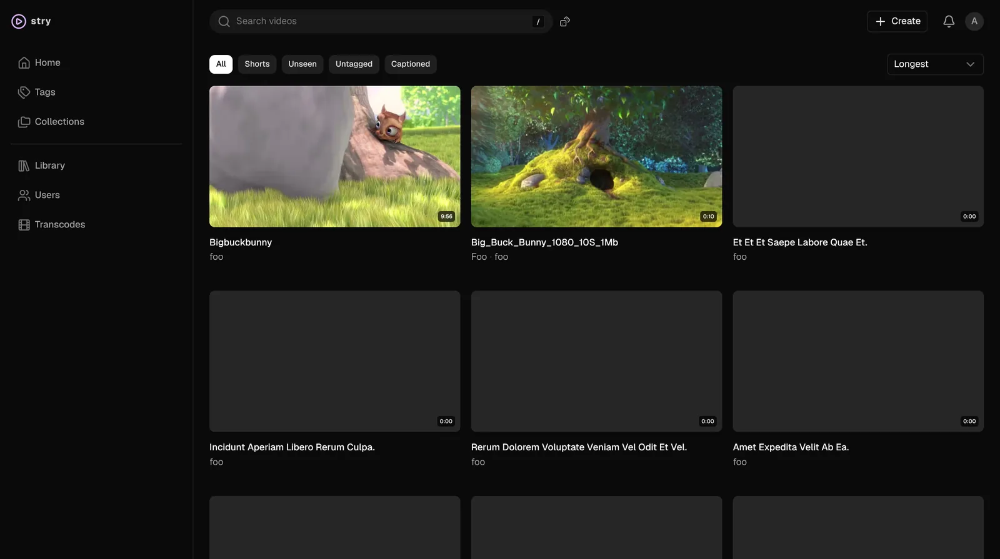
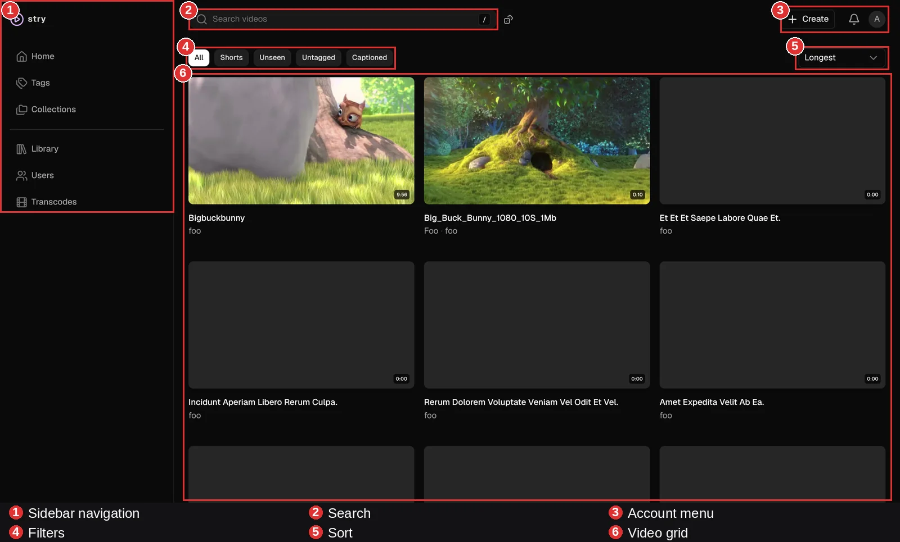

# Screenshots

A quick look at stry in action.

## At a glance

<a href="#home">

Home — Video Library
</a>

## Home — Video Library {#home}

The landing page: a searchable, filterable grid of your videos, with quick access to Tags, Collections, Library, Users, and Transcodes from the sidebar.

Library
Search
Filters
Sorting
Sidebar navigation
Create menu

**What's where:**

> [!NOTE]
> More screenshots coming soon (player, shuffle, tags, profiles). Drop new files into `docs/screenshots/originals/`, then add a matching thumbnail + section above.
